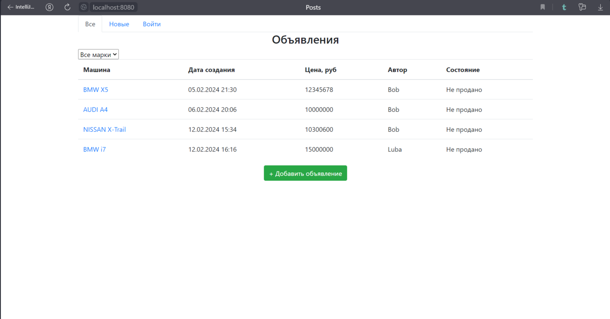
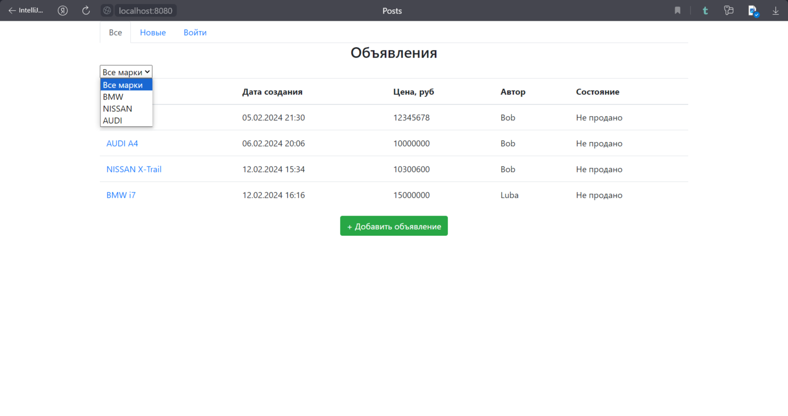
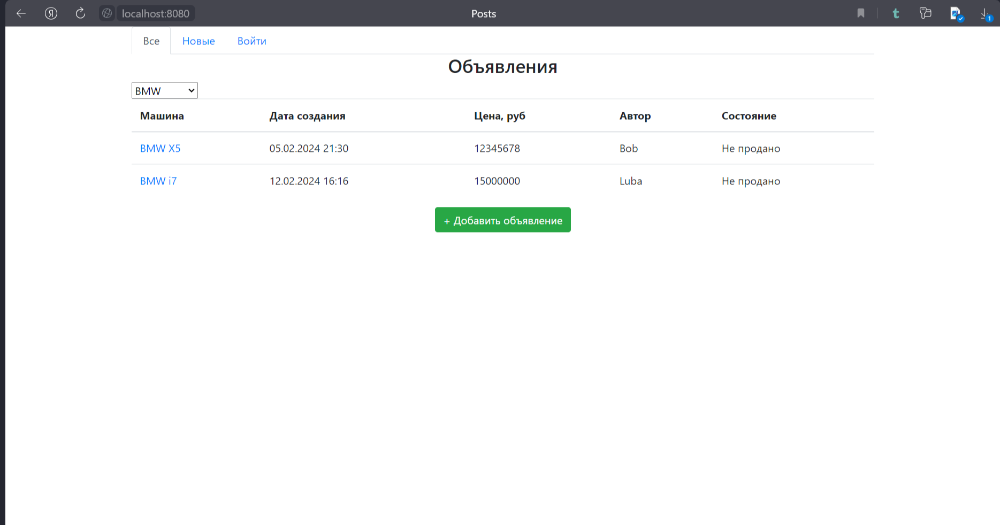
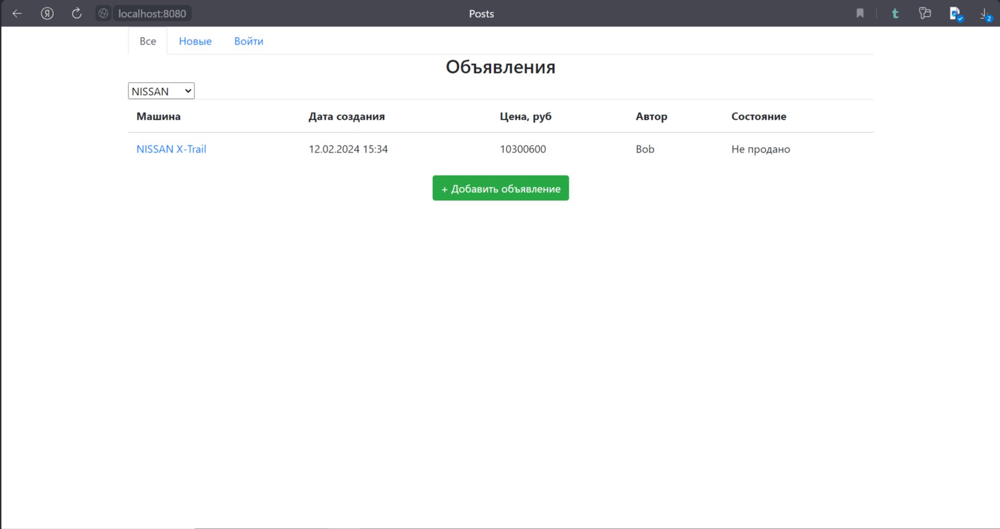
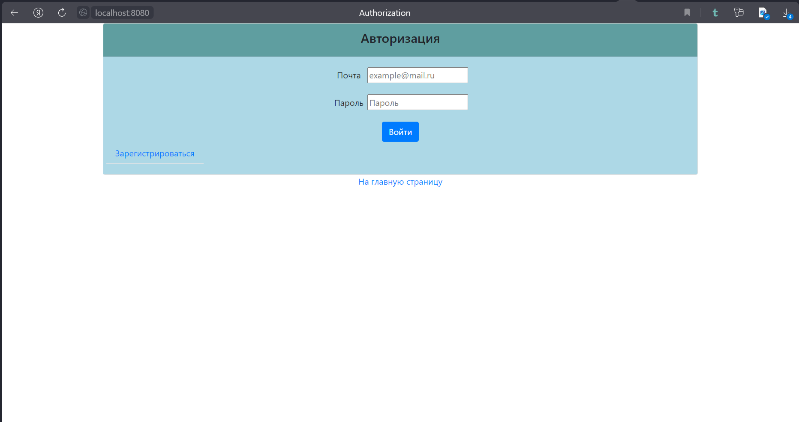
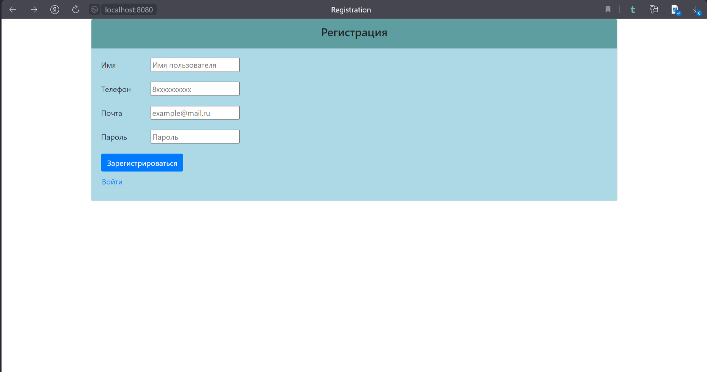

This repository contains a web-application for car sales.

A main page looks like this:

The main page contains a table with all posts about car sales. Also you can show only

1. Основная страница. таблица со всеми объявлениям машин на продажу.
2. На странице должна быть кнопка. добавить новое объявление.
3. Переходить на страницу добавления.
4. Должны быть категории машины, марка, тип кузова и тд. Пример с сайта auto.ru.
5. Можно добавлять фото.
6. объявление имеет статус продано. или нет.
7. Должны существовать пользователи. кто подал заявление. только он может менять статус.