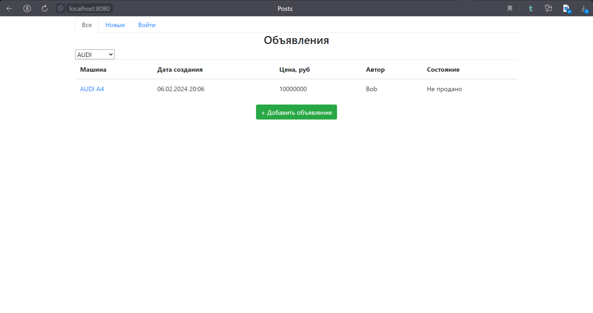

This repository contains a web-application for car sales.

A main page looks like this:

The main page contains a table with all posts about car sales. You can also show only one brand you need.

BMW:

NISSAN:

AUDI:

In addition, you can only show new posts. All you need to do is click on the "new" tab:   

If you want to add your own post you must first log in. To do this, click the "log in" button at the top of the main
page or click on the "Add post" button,

and you will find yourself on the authorization page:

You need to fill in all the fields, otherwise you will be warned about filling in all the fields:

If your email or password are incorrect, you will be warned about ut:

If you don't have an account, then click on the "register" button, and you will find yourself on the registration page:

Fill in all the fields, otherwise you will be warned about filling in all the fields:

If everything goes well, you will find yourself on the success page:

After registration, you can log in. Let's go back to the main page. There is the "Add post" button on it, clicking on
which takes us to the editing page, where we can fill in information about the car: make, model, body type, engine
model, etc.

Now we don't see all the fields. However, as soon as we select the desired brand from the drop-down list, two more
fields will appear (engine and model):

Next, if we select the desired model from the drop-down list,

a field for selecting the body will appear:

If we check the "photo" box, we can add a photo to the post (this is not necessary).

You must fill in all the fields (the photo is optional), otherwise you will see a notification about the need to fill in
all the fields.

Let's go back to the main page. If you click on the desired post, you will go to a page with a description of the post:

There are "sold" and "delete" buttons on this page, which allow you to mark a post as sold and delete a post,
respectively. However, only the author of the post can perform these actions, otherwise you will receive a notification
that you cannot perform this action.
